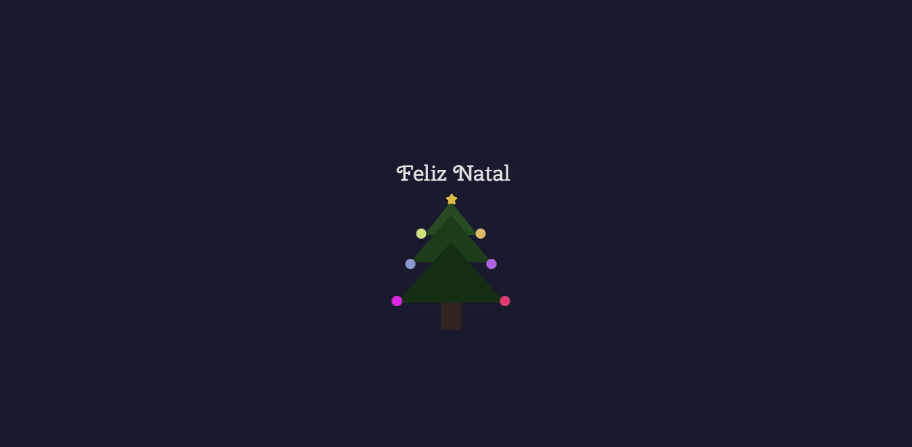

# 🎄 Natal Tech: Árvore Interativa

> **Status do Projeto:** Concluído ✅

Este projeto é uma aplicação web temática que simula uma Árvore de Natal interativa. Desenvolvido para explorar conceitos de estilização CSS e interatividade com JavaScript, o projeto foca em animações fluidas e uma estética moderna.

---

## 🛠 Tecnologias e Ferramentas

---

## 🎨 Preview do Projeto
[Feliz Natal](https://carolinarlima.github.io/feliz-natal/)
 

---

## 🚀 Funcionalidades Principais

* **Iluminação Dinâmica:** Sistema de luzes que utilizam animações `keyframes` para criar efeitos de pulsação.
* **Interatividade:** Controle de estados (ligado/desligado) via manipulação do DOM com JavaScript.
* **Design Responsivo:** A estrutura se adapta para uma visualização perfeita tanto no desktop quanto no mobile.
* **Estética Personalizada:** Uso de sombras (`box-shadow`) para criar o efeito de brilho (glow) no ambiente escuro.

---

## 🧠 Aprendizados e Desafios

Neste projeto, foquei em consolidar os seguintes conhecimentos:

1.  **CSS Positions:** Organização de camadas para montar a árvore e posicionar os enfeites.
2.  **Pseudo-elementos:** Uso de `::before` e `::after` para reduzir a quantidade de tags no HTML.
3.  **Lógica de Eventos:** Captura de cliques para disparar as funções de animação.

---
